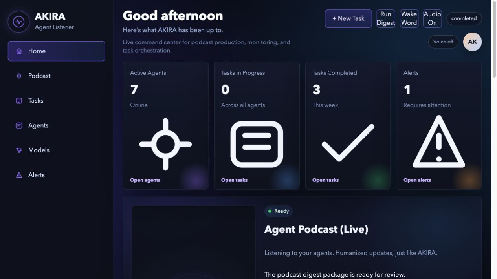

# Idea Workshop: AKIRA Multi-Agent Platform v1

This repository is the composition repo for a local-first, single-user multi-agent platform focused on a first workflow: turning a news topic into a sourced podcast script package while streaming human-friendly progress.



## What is implemented here

- `apps/dashboard`: Node-powered dashboard server and browser UI with:
  - task creation
  - live SSE status feed
  - replay view
  - speech synthesis playback
  - browser speech recognition with a wake-phrase command loop
  - WebSocket voice-control session that forwards commands to the orchestrator
  - operations overview for service health, model usage, and monitoring podcast digests
- `services/orchestrator`: Python orchestration service with:
  - explicit graph workflow
  - optional LangGraph seam with a no-dependency fallback runtime
  - REST task APIs
  - SSE machine/narrative event streaming
  - structured JSON service logs
  - Prometheus-style metrics endpoint
  - model-usage summary APIs
  - dynamic model router with URL/auth/credentials and per-role mapping
  - scheduled monitoring podcast digest generation
  - Elastic-preferred log reading with local log-mirror fallback
  - generated playable monitoring audio payloads
  - replay, interrupt, confirm, pause, resume, reprioritize hooks
  - HTTP seams for MCP data access, storage, and agent workers
- `services/storage-mcp-platform`: Node storage service with:
  - deployment-selectable backend contract
  - full disk-backed task/event/artifact persistence
  - vector-style upsert/query/delete on a disk index
  - structured JSON service logs
  - Prometheus-style metrics endpoint
  - retention/purge endpoints
  - capability discovery
- `services/agent-runtime`: Kotlin worker-runtime service with bounded role handlers for source discovery, ranking, drafting, citation validation, and show-note generation
- `ops/observability`: collector and metrics scrape scaffolding for Elastic/Prometheus-style observability
- `k8s`: starter manifests for dashboard, orchestrator, storage, and NATS
- `config/akira.yaml`: single deployment config for Kubernetes service/dependency generation
- `docker-compose.yml`: local composition including optional sibling-repo services

## Prerequisites

Use these versions or newer unless your local tooling is already compatible:

- macOS, Linux, or WSL
- Node.js 20+
- Python 3.11+
- Java 21 for the Kotlin agent runtime
- Docker Desktop or Docker Engine with Compose v2
- `kubectl` for Kubernetes deployment
- A local sibling checkout of `mcp-server-generic` at `../mcp-server-generic` when using Docker Compose
- Optional: `gh` for GitHub operations and `curl` for API smoke checks

The repo currently uses mostly built-in Node and Python libraries, so there is no required root `npm install` for the dashboard/storage/orchestrator slice. The Kotlin runtime uses its checked-in Gradle wrapper under `services/agent-runtime/`.

## Install Prerequisites

On macOS with Homebrew:

```bash
brew install node python openjdk@21 kubectl gh
brew install --cask docker
```

If `java -version` does not find Java 21 after installation, add it to your shell profile:

```bash
export PATH="/opt/homebrew/opt/openjdk@21/bin:$PATH"
```

Clone the AKIRA repo:

```bash
git clone https://github.com/AravinthhKrish/akira.git idea-workshop
cd idea-workshop
```

For Docker Compose mode, also clone the MCP dependency as a sibling directory:

```bash
cd ..
git clone https://github.com/AravinthhKrish/mcp-server-generic.git
cd idea-workshop
```

## What to configure

Start with [config/akira.yaml](config/akira.yaml). It is the single deployment input for generated Kubernetes manifests. Edit this file first, then deploy with `npm run deploy:k8s`.

Configure these blocks first:

- `platform`: namespace, labels, and local observability log directory.
- `services`: enabled services, image names, ports, and replica counts.
- `dependencies.api`: internal service URLs for dashboard, orchestrator, storage, MCP, agent runtime, and NATS.
- `dependencies.db`: storage backend. `disk` is the simplest local mode; MongoDB and Weaviate URLs can be supplied for richer backends.
- `dependencies.llm`: LLM provider catalog, default provider/model, router URL, auth mode, and role/stage/task model mappings.
- `dependencies.observability`: Elastic index pattern, Elasticsearch URL, Prometheus, and OpenTelemetry collector settings.

The LLM model router can also be updated at runtime from the dashboard Models page or by posting to `/v1/model-router`. Provider catalogs are the approved source of model choices. Use `provider-id:model-name` in role or stage maps when you want a specific provider, for example `openai:gpt-4.1`.

The New Task form reads the same provider catalog and lets you choose one configured model for that task. The selected value is saved as `modelPreference` and overrides role/stage defaults for every bounded agent stage in that task.

## Repo layout

```text
apps/
  dashboard/
docs/
  journey/
packages/
  contracts/
services/
  agent-runtime/
  orchestrator/
  storage-mcp-platform/
k8s/
scripts/
```

## Planning and journey docs

The running architecture/context record lives under `docs/journey/`.

- `docs/journey/master-plan.md`: current top-level product and system plan
- `docs/journey/records/`: dated context snapshots, prompt summaries, and iteration notes
- `docs/journey/layers/`: layer-by-layer subplans for dashboard, orchestrator, storage, agents, contracts, and ops

This directory is meant to grow with the project so the reasoning trail stays inside the repo rather than getting lost in chat history.

## Local verification snapshot

The current vertical slice has been exercised locally with:

- `python3 -m unittest discover -s services/orchestrator/tests`
- `node --test services/storage-mcp-platform/tests/storage.test.mjs apps/dashboard/server.test.mjs`
- `./gradlew test` from `services/agent-runtime/`

The latest dated verification note lives in `docs/journey/records/2026-07-05-local-verification.md`.

## Install And Verify

Check the local toolchain:

```bash
node --version
python3 --version
java -version
docker compose version
kubectl version --client
```

Run focused tests:

```bash
npm run test:dashboard
npm run test:storage
npm run test:k8s
python3 -m unittest discover services/orchestrator/tests
cd services/agent-runtime && ./gradlew test
```

## Start Locally

Manual local mode is useful during development and does not require Docker. Start these in separate terminals from the repo root:

```bash
npm run storage
python3 services/orchestrator/server.py
npm run dashboard
```

Then open [http://localhost:3000](http://localhost:3000).

Optional health checks:

```bash
curl http://127.0.0.1:9100/health
curl http://127.0.0.1:9000/health
curl http://127.0.0.1:3000/health
```

Run the end-to-end smoke test after all three services are healthy:

```bash
npm run smoke
```

## Start With Docker Compose

Make sure the sibling MCP repo exists first:

```bash
cd ..
git clone https://github.com/AravinthhKrish/mcp-server-generic.git
cd idea-workshop
```

Build and start the full local stack:

```bash
docker compose build
docker compose up -d
```

Or run the orchestrated local deployment script, which generates Kubernetes config, builds Compose images, starts services, waits for health checks, and runs smoke tests:

```bash
npm run deploy:local
```

Add observability services when needed:

```bash
docker compose --profile observability up -d
```

## Stop Services

Stop manual local mode with `Ctrl+C` in each service terminal.

Stop Docker Compose mode:

```bash
docker compose down
```

Stop Compose and remove named volumes:

```bash
docker compose down -v
```

If a port is already in use, check which process owns it:

```bash
lsof -i :3000
lsof -i :9000
lsof -i :9100
```

## Kubernetes config generation

AKIRA's Kubernetes deployment can be generated from one source-of-truth file:

```bash
npm run k8s:generate
kubectl apply -f k8s/generated/akira.yaml
```

Or use the single-command deployment path:

```bash
npm run deploy:k8s
```

Edit `config/akira.yaml` to change service images, enabled services, API URLs, storage backend, LLM model router settings, NATS, and observability wiring. The generated manifest is written to `k8s/generated/akira.yaml`.

Stop the generated Kubernetes deployment:

```bash
npm run undeploy:k8s
```

## Notes about external services

- `mcp-server-generic` is treated as a sibling dependency and can be wired in through `MCP_SERVER_URL`.
- `api-chat-app` informed the orchestration shape, but this repo is not tied to its domain model.
- The event model is JetStream-ready, but the runnable local slice persists canonical events through `storagemcp-platform` so the repo works without additional client libraries.
- Structured service logs also mirror locally under `data/observability/logs` so the monitoring digest workflow can read them in local-first mode before a full Elastic stack is running.
- Dynamic model routing is controlled by the orchestrator through `/v1/model-router` and `MODEL_ROUTER_*` environment variables when you want to point AKIRA at a real router endpoint with auth.
- LLM provider APIs are configured through the Models page or `POST /v1/model-router`. Use `providers` for approved API/model catalogs and route agents with either `model-name` or `provider-id:model-name`.

Example provider catalog payload:

```json
{
  "defaultProvider": "openai",
  "defaultModel": "gpt-4.1-mini",
  "providers": [
    {
      "id": "openai",
      "label": "OpenAI",
      "url": "https://api.example.com/v1/responses",
      "authMode": "bearer",
      "credentials": { "bearerToken": "replace-at-runtime" },
      "models": ["gpt-4.1-mini", "gpt-4.1"],
      "defaultModel": "gpt-4.1-mini",
      "enabled": true
    }
  ],
  "roleModels": { "draft_script": "openai:gpt-4.1" }
}
```
